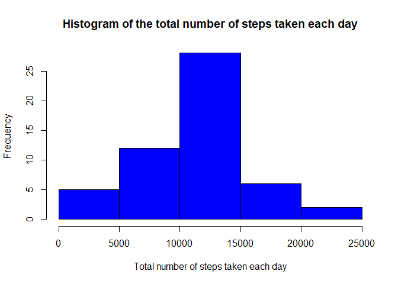
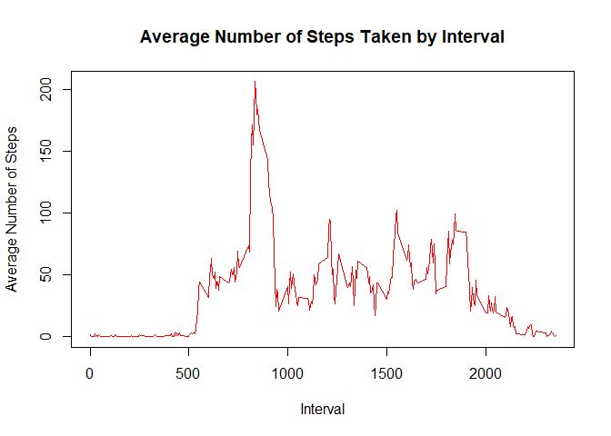
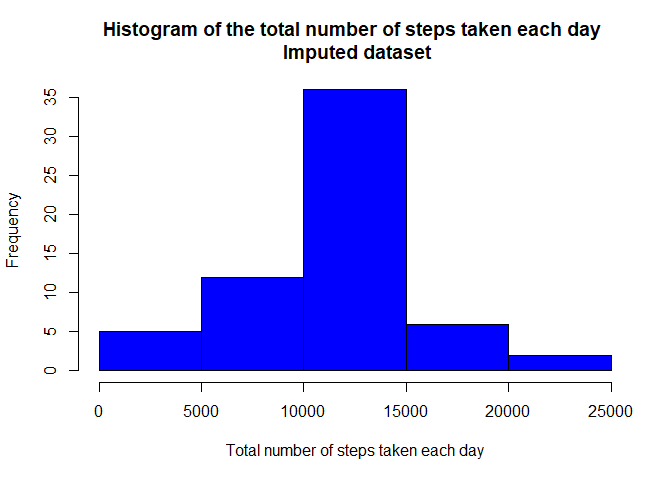
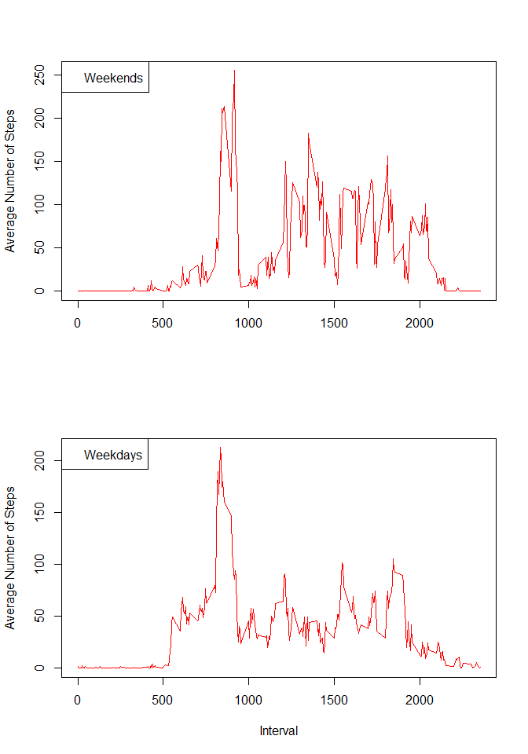

# Reproducible Research: Peer Assessment 1


## Loading and preprocessing the data

```r
library(dplyr)
```

```
## 
## Attaching package: 'dplyr'
```

```
## The following objects are masked from 'package:stats':
## 
##     filter, lag
```

```
## The following objects are masked from 'package:base':
## 
##     intersect, setdiff, setequal, union
```

```r
unzip("activity.zip")
d <- read.csv("activity.csv")
```


## What is mean total number of steps taken per day?

1. Calculate the total number of steps taken per day

```r
dt_day <- d %>% group_by(date) %>% summarise(StepsPerDay = sum(steps)) 
```

2. Make a histogram of the total number of steps taken each day

```r
hist(dt_day$StepsPerDay, col = "blue", xlab = "Total number of steps taken each day", main = "Histogram of the total number of steps taken each day")
```

<!-- -->

3. Calculate and report the mean and median of the total number of steps taken per day

- Mean: 

```r
Mean <- mean(dt_day$StepsPerDay, na.rm = TRUE)
Mean
```

```
## [1] 10766.19
```

- Median:

```r
Median <- median(dt_day$StepsPerDay, na.rm = TRUE)
Median
```

```
## [1] 10765
```


## What is the average daily activity pattern?

1. Time series plot of the 5-minute interval and the average number of steps taken, averaged across all days 


```r
da_int <- d %>% group_by(interval) %>% summarise(StepsPerInt = mean(steps, na.rm = TRUE))
plot(y = da_int$StepsPerInt, x=da_int$interval, type="l", col="red", xlab="Interval", ylab ="Average Number of Steps" , main = "Average Number of Steps Taken by Interval")
```

<!-- -->

2. Which 5-minute interval, on average across all the days in the dataset, contains the maximum number of steps?

```r
Int_Max_Avg_Steps <- da_int$interval[which.max(da_int$StepsPerInt)]
Int_Max_Avg_Steps
```

```
## [1] 835
```


## Imputing missing values

1. Calculate and report the total number of missing values in the dataset (i.e. the total number of rows with NAs)

```r
No_of_NAs <- sum(is.na(d$steps))
No_of_NAs
```

```
## [1] 2304
```

3. Create a new dataset that is equal to the original dataset but with the missing data filled in as **the mean for that 5-minute interval**

```r
d_imp <- d %>% left_join(da_int, by = "interval") %>% mutate(steps = ifelse(!is.na(steps),steps,floor(StepsPerInt))) %>% select(steps, date, interval)
```

4. Histogram of the total number of steps taken each day and 

```r
d_imp_day <- d_imp %>% group_by(date) %>% summarise(StepsPerDay = sum(steps)) 
hist(d_imp_day$StepsPerDay, col = "blue", xlab = "Total number of steps taken each day", main = "Histogram of the total number of steps taken each day \n Imputed dataset")
```

<!-- -->


5. Calculate and report the mean and median total number of steps taken per day

```r
Mean_imp <- mean(d_imp_day$StepsPerDay)
Median_imp <- median(d_imp_day$StepsPerDay)
```
 - Mean of original dataset:

```r
 Mean
```

```
## [1] 10766.19
```

 - Mean of imputing dataset:

```r
 Mean_imp
```

```
## [1] 10749.77
```

As we can see the difference is minimal and may be explained by rounding (using floor function) steps values in imputing process.


 - Median of original dataset:

```r
 Median
```

```
## [1] 10765
```

 - Median of imputing dataset:

```r
 Median_imp
```

```
## [1] 10641
```

The difference in medians a little bigger than in means but still neglectable. 
So inputing missed data does not significantly affected results in our case.


## Are there differences in activity patterns between weekdays and weekends?

1. Create a new variable in the dataset indicating whether a given date is a weekday or weekend day.

```r
d_imp <- d_imp %>% mutate(wd = ifelse(weekdays(as.Date(d_imp$date)) == "Saturday" | weekdays(as.Date(d_imp$date)) == "Saturday", "weekend", "weekday"))
```

2. Panel plot containing a time series plot (i.e. type = "l") of the 5-minute interval (x-axis) and the average number of steps taken, averaged across all weekday days or weekend days (y-axis).

```r
da_weekend_int <- d_imp %>% filter(wd == "weekend") %>% 
                            group_by(interval) %>% summarise(StepsPerInt = mean(steps, na.rm = TRUE))

da_weekday_int <- d_imp %>% filter(wd == "weekday") %>% 
                            group_by(interval) %>% summarise(StepsPerInt = mean(steps, na.rm = TRUE))
```


```r
par(mfcol = c(2,1))
plot(y=da_weekend_int$StepsPerInt,x=da_weekend_int$interval,type="l",col="red",xlab="",ylab ="Average Number of Steps")
legend("topleft", legend="Weekends")
plot(y=da_weekday_int$StepsPerInt,x=da_weekday_int$interval,type="l",col="red",xlab="Interval",ylab ="Average Number of Steps")
legend("topleft", legend="Weekdays")
```

<!-- -->
